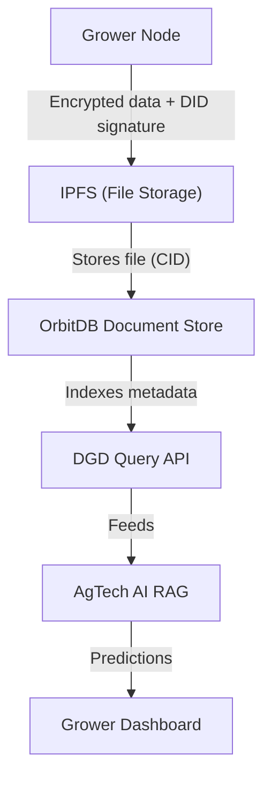

# Decentralized Genetic Database (DGD) – Blueprint

## Vision

A community‑owned, tamper‑proof, and searchable database of plant and fungal genetic test results, cultivation metadata, and performance data. This database powers the "Network Data" layer of the AgTech AI, enabling growers to contribute data, earn tokens, and receive AI‑optimized cultivation advice.

## Why Decentralized?

| Centralized DB (MySQL, MariaDB) | Decentralized DB (OrbitDB + IPFS) |
|--------------------------------|-----------------------------------|
| Single point of control | No single owner – community governed |
| Data can be altered or deleted | Immutable, append‑only, tamper‑proof |
| Vendor lock‑in | Portable, self‑hostable |
| Contributor cannot verify integrity | Anyone can audit the entire history |

## Governance Model

The DGD is **not** a free‑for‑all. It balances openness with quality control using decentralized mechanisms:

- **Write access**: Only DIDs that have staked a minimum number of AG tokens can add new records.
- **Dispute resolution**: Token holders can vote to mark false data as "spam" (data is never deleted, but hidden from default queries).
- **AI integration**: The AI checks for duplicates and data quality before a submission is accepted. The submission is then broadcast to the network.
- **Transparency**: Every addition is signed, timestamped, and permanently recorded in the provenance log.

## Roles and Incentives

| Role | Data contributed | Token reward rate | Voting rights |
|------|------------------|------------------|---------------|
| **Grower** | Live sensor data, harvest logs, manual observations | **High** (core value) | ✅ Yes (by staking AG) |
| **Laboratory** | Genetic, chemical, potency test results | **Medium** (supporting value) | ❌ No (unless individually staking) |
| **AI / Node operator** | Computation, storage, network | **Low** (infrastructure) | ✅ Yes (by staking AG) |

## Architecture Overview



## Data Schema

### 1. Plant / Strain Registry (OrbitDB Document Store)

```json
{
  "_id": "strain-unique-id",
  "type": "mushroom",
  "common_name": "King Oyster",
  "scientific_name": "Pleurotus eryngii",
  "variety": "eryngii",
  "cultivation_params": {
    "optimal_temp_c": 24,
    "optimal_humidity": 85,
    "substrate": "Hardwood sawdust",
    "light_cycle_hours": 12
  },
  "test_results": [
    "QmHashForPotencyReport",
    "QmHashForGeneticMarkers"
  ],
  "creator_did": "did:key:grower-abc",
  "timestamp": "2026-05-30T14:30:00Z"
}
```

### 2. Test Results (IPFS file – any format)

The actual lab report (PDF, CSV, JSON) is stored on IPFS. Its CID is referenced in the `test_results` array.

### 3. Provenance Log (OrbitDB Log Store)

```json
{
  "action": "add_strain",
  "did": "did:key:grower-abc",
  "cid": "QmHashOfStrainDoc",
  "timestamp": "2026-05-30T14:30:00Z",
  "signature": "base64..."
}
```

## Implementation Roadmap

- [ ] **Month 1 – Foundation**: Install OrbitDB and IPFS, create a Document Store, insert a test strain.
- [ ] **Month 2 – Contribution Workflow**: CLI tool to upload lab reports, sign with DID, add to OrbitDB, log provenance.
- [ ] **Month 3 – Tokenomics Integration**: Scan log to count contributions, generate token reward report, manually distribute.
- [ ] **Month 4 – Web Interface & API**: Lightweight UI to browse strains, read‑only API for AI queries.

## Integration with AgTech AI

The DGD becomes the **Global Library** for your RAG system. The AI queries the DGD API to retrieve cultivation parameters and test results, grounding predictions in verifiable data.

## Running Your Own DGD Node

```bash
git clone https://github.com/Anureyki/DGD-Node.git
cd DGD-Node
npm install
cp .env.example .env
node start.js
```

## Related Documents

- [AgNetworking Ecosystem Overview](https://github.com/Anureyki/AgNetworking/blob/main/ecosystem-overview.md)
- [Privacy Stack](https://github.com/Anureyki/AgNetworking/blob/main/privacy-stack.md)
- [Tokenization Roadmap](https://github.com/Anureyki/AgNetworking/blob/main/TOKENIZATION_ROADMAP.md)

## Next Actions for You

1. This README includes a corrected Mermaid diagram, governance model, and roles.
2. Start Month 1 – install OrbitDB and IPFS locally, run the hello-world example.
3. When you implement the contribution workflow, add the staking and voting logic described above.

---
*This is a living document. Update as you implement each phase.*
